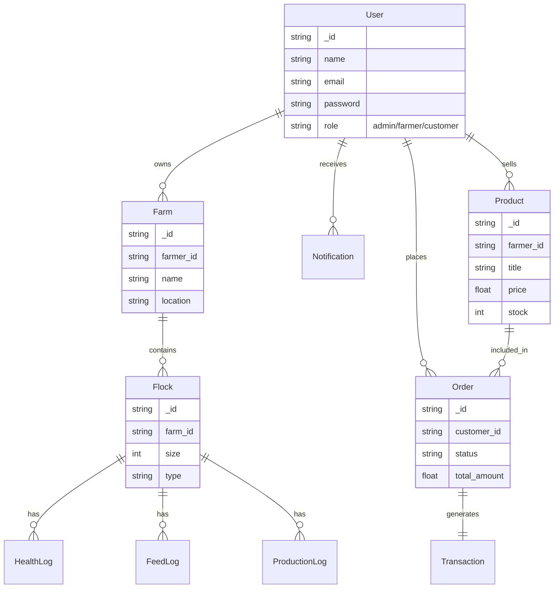

# PoultrySmart - Comprehensive Poultry Farm Management System

PoultrySmart is a full-stack MERN application designed to streamline the operations of poultry farming. It connects administrators, farmers, and customers in a unified platform, offering specialized dashboards for farm management, product purchasing, and system administration.

## 🌟 Key Features

### 👨‍🌾 Farmer Dashboard
- **Farm & Flock Management**: Track multiple farms and flocks of poultry.
- **Log Management**: Maintain detailed records for health, feeding, and egg/meat production.
- **Inventory Tracking**: Manage stock of products available for sale.

### 🛒 Customer Dashboard
- **Product Shop**: Browse and purchase available poultry products.
- **Wishlist**: Save favorite products for later.
- **Order Tracking**: Detailed timeline tracking of placed orders.
- **Profile Management**: Update personal and shipping information.

### 👑 Admin Dashboard
- **System Oversight**: Monitor platform statistics and user activities.
- **User Management**: Approve and manage farmer and customer accounts.
- **Transactions & Orders**: Oversee global sales and platform transactions.

## 💻 Tech Stack

- **Frontend**: React.js, Vite, Chart.js, CSS
- **Backend**: Node.js, Express.js
- **Database**: MongoDB (Mongoose)
- **Authentication**: JWT (JSON Web Tokens), bcryptjs

## 📊 UML Diagrams

### System Architecture Diagram

```mermaid
graph TD
    Client[Web Browser - React/Vite] -->|HTTP/REST APIs| Server[Node.js / Express Backend]
    Server -->|Mongoose ODMS| DB[(MongoDB)]
    
    subgraph Frontend [Frontend Applications]
        AdminDashboard[Admin Dashboard]
        FarmerDashboard[Farmer Dashboard]
        CustomerDashboard[Customer Dashboard]
    end
    
    Client -.-> Frontend
    
    subgraph Backend Services [Express Services]
        AuthService[Authentication & JWT]
        FarmService[Farm & Flock Management]
        ProductService[Product API]
        OrderService[Orders & Transactions API]
    end
    
    Server -.-> Backend Services
```

### Entity-Relationship (ER) Diagram



## 🚀 Local Development Guide

### 1. Prerequisites
- **Node.js** (LTS version recommended)
- **MongoDB**: Community Server running locally on `mongodb://localhost:27017` or MongoDB Atlas.

### 2. Backend Setup
Navigate to the `backend` directory, install dependencies, and start the server:

```bash
cd backend
npm install
```

Create a `.env` file in the `backend/` directory:
```env
PORT=5000
MONGO_URI=mongodb://localhost:27017/poultrysmart
JWT_SECRET=your_super_secret_key
CORS_ORIGIN=http://localhost:5173
```

Seed the database and run the server:
```bash
npm run seed
npm run start
```
*Backend runs on `http://localhost:5000`*

### 3. Frontend Setup
From the project root directory, install dependencies and start the Vite dev server:

```bash
npm install
```

Create a `.env` file in the root directory:
```env
VITE_API_BASE_URL=http://localhost:5000
```

Start the application:
```bash
npm run dev
```
*Frontend runs on `http://localhost:5173`*

## 🔑 Demo Accounts (Seeded)

- **Admin**: `admin@poultry.com` / `admin123`
- **Farmer**: `ravi@farm.in` / `farmer123`
- **Customer**: `priya@gmail.com` / `customer123`

---
*Built with ❤️ for better poultry management.*
